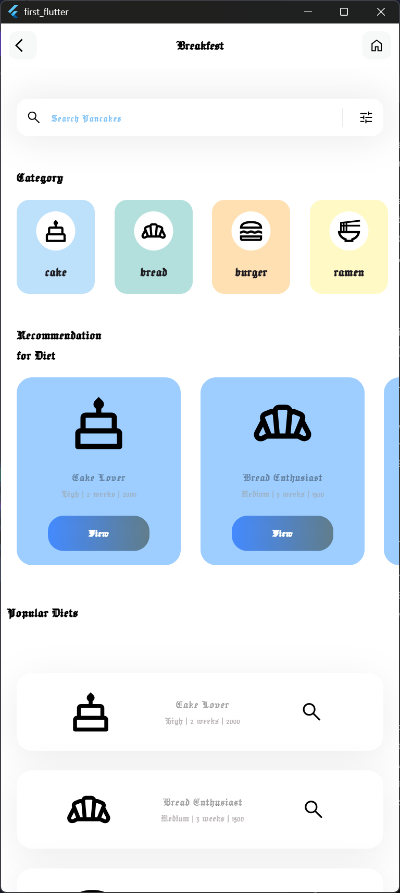

# Layout for food application

## application:

A food and diet app that offers personalized diet recommendations, search functionality, and interactive categories

### Fonts from:
- <a href="https://fonts.google.com" target="_blank">Google Fonts</a>

### flutter svg from:
- <a href="https://pub.dev/packages/flutter_svg">flutter svg</a>

### icons from:
- <a href="https://fonts.google.com/icons?selected=Material+Symbols+Outlined:home:FILL@0;wght@400;GRAD@0;opsz@24&icon.size=24&icon.color=%23e8eaed">Google Icons</a>